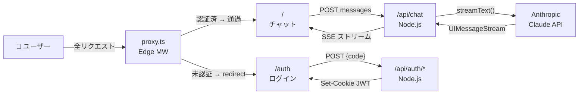

# 01_要件定義書

## 1. プロジェクト概要

**プロジェクト名**: Vercel Claude App  
**プロジェクトID**: opus-46  
**発注者**: -  
**開発者**: -  
**版**: 1.0  
**作成日**: 2026-06-18  

### 1.1 プロジェクトの目的

Anthropic Claude AI と統合した Web ベースのチャットアプリケーション。4桁アクセスコードによるシンプルな認証を通過したユーザーが、複数の Claude モデルとリアルタイムに対話できる。マークダウンレンダリング・コード強調表示・画像添付・Extended Thinking（思考プロセス表示）など、実用的な研究・執筆支援機能を提供する。

### 1.2 プロジェクトの背景

- Anthropic Claude API（Opus 4.6 / Sonnet 4.6 / Haiku 4.5）の機能を最大限活用
- Extended Thinking によるモデルの多段階推論の可視化
- Vercel Edge + Node.js ハイブリッドランタイムでの高速デプロイ
- 単一共有アクセスコード方式による軽量認証（ユーザー管理不要）

### 1.3 用語集

| 用語 | 説明 |
|------|------|
| アクセスコード | ログインに使用する4桁の数字コード。サーバー環境変数 `ACCESS_CODE` で管理 |
| JWT | JSON Web Token。認証セッションをクッキーに格納するために使用 |
| Extended Thinking | Anthropic モデルの多段階推論機能。Opus/Sonnet で有効化可能 |
| Effort レベル | 推論の深さ設定。5段階（低/中/高/超高/最大）でトークン予算と温度を制御 |
| UIMessageStream | AI SDK v6 の `toUIMessageStreamResponse()` によるストリーミングプロトコル |
| FOUC | Flash of Unstyled Content。ページ表示時のちかつき現象 |
| proxy.ts | Next.js のルートミドルウェアとして機能するファイル（Next.js 慣習の `middleware.ts` とは異なる命名） |
| reasoning | Extended Thinking 実行時にモデルが生成する思考テキスト。`ThinkingBlock` で表示 |

---

## 2. スコープ

### 2.1 スコープ内

- 4桁アクセスコードによる認証・セッション管理
- Claude AI とのリアルタイムチャット（ストリーミング）
- マルチモデル対応（Opus 4.6 / Sonnet 4.6 / Haiku 4.5）
- 5段階 Effort レベル設定
- Extended Thinking の有効化（Opus/Sonnet のみ）
- マークダウン・コードブロック表示
- 画像添付送信（PNG/JPEG/GIF/WebP）
- ダークモード切替と設定永続化
- 思考プロセス（reasoning）の折りたたみ表示
- Vercel へのデプロイ

### 2.2 スコープ外

- ユーザー管理（複数ユーザー、登録、プロフィール）
- 会話履歴の永続化・検索
- 画像以外のファイルアップロード
- マルチテナント
- モバイルアプリ（ネイティブ）
- リアルタイム共有・コラボレーション
- 課金・サブスクリプション管理

---

## 3. システムデータフロー概観



---

## 4. 機能要件

### 4.1 認証機能

| 要件ID | 項目 | 詳細 |
|--------|------|------|
| REQ-AUTH-001 | アクセスコード認証 | 4桁数字の単一共有アクセスコードによる認証。ユーザー管理なし |
| REQ-AUTH-002 | ログイン画面 | `/auth` に OTP 風4桁入力フォーム（数字1桁ずつ・自動フォーカス送り・ペースト対応） |
| REQ-AUTH-003 | 自動送信 | 4桁目入力完了で自動的に認証リクエストを送信 |
| REQ-AUTH-004 | JWT セッション | 認証成功時に `{ authenticated: true }` を payload とする HS256 JWT を `auth_session` クッキーに保存 |
| REQ-AUTH-005 | セッション有効期限 | 30日間（`Max-Age=2592000`） |
| REQ-AUTH-006 | ログアウト | `POST /api/auth/logout` でクッキーを削除し `/auth` に遷移 |
| REQ-AUTH-007 | 認証済みの自動リダイレクト | `/auth` にアクセスした認証済みユーザーをサーバー側で `/` へリダイレクト |
| REQ-AUTH-008 | 不正アクセス防止 | 未認証・JWT 無効のリクエストは `proxy.ts`（Edge）でブロックし `/auth` へリダイレクト |

### 4.2 チャット機能

| 要件ID | 項目 | 詳細 |
|--------|------|------|
| REQ-CHAT-001 | メッセージ送受信 | テキストメッセージの送受信 |
| REQ-CHAT-002 | ストリーミング対応 | AI SDK v6 の UIMessageStream でリアルタイム受信・表示 |
| REQ-CHAT-003 | 会話履歴管理 | セッション中の会話履歴を `useChat` フックのメモリで管理 |
| REQ-CHAT-004 | マークダウン表示 | `react-markdown` + `remark-gfm` で GFM 形式をレンダリング |
| REQ-CHAT-005 | コード強調表示 | `react-syntax-highlighter`（Prism）で言語別ハイライト・6行超で行番号表示 |
| REQ-CHAT-006 | コピー機能 | メッセージおよびコードブロックのクリップボードコピー（2秒フィードバック） |
| REQ-CHAT-007 | エラーリカバリ | `useChat` の `onError` でエラー検出。401/Unauthorized は `/auth` 自動遷移、その他はエラーバナー + `regenerate()` リトライボタン表示 |
| REQ-CHAT-008 | 入力エリア自動リサイズ | テキストエリアが入力量に応じ自動リサイズ（最大200px） |
| REQ-CHAT-009 | キーボードショートカット | Enter で送信、Shift+Enter で改行 |
| REQ-CHAT-010 | 会話リセット | "New" ボタン（メッセージ存在時）でページリロードしセッションをリセット |

### 4.3 画像添付機能

| 要件ID | 項目 | 詳細 |
|--------|------|------|
| REQ-IMG-001 | 画像ファイル添付 | PNG/JPEG/GIF/WebP をペーパークリップボタンまたは Ctrl+V ペーストで添付 |
| REQ-IMG-002 | 添付プレビュー | 添付画像のサムネイル表示と削除ボタンの提供 |
| REQ-IMG-003 | 送信処理 | `convertFileListToFileUIParts`（ai SDK）で `FileUIPart` に変換し送信 |

### 4.4 モデル選択機能

| 要件ID | 項目 | 詳細 |
|--------|------|------|
| REQ-MODEL-001 | モデル選択 | ヘッダの `<select>` で Opus 4.6 / Sonnet 4.6 / Haiku 4.5 を選択 |
| REQ-MODEL-002 | 既定モデル | Haiku 4.5（`claude-haiku-4-5-20251001`）を既定 |
| REQ-MODEL-003 | サーバー側検証 | サーバーが `ALLOWED_MODEL_IDS` で許可リスト検証。未知のモデル ID は既定に差し替え |

### 4.5 Effort レベル / Extended Thinking 機能

| 要件ID | 項目 | 詳細 |
|--------|------|------|
| REQ-EFFORT-001 | 5段階選択 | 低/中/高/超高/最大の5段階。既定は高（`high`） |
| REQ-EFFORT-002 | Extended Thinking | Opus/Sonnet のみ有効化可能なトグルスイッチ |
| REQ-EFFORT-003 | thinking/temperature 排他 | Thinking 有効時は `budgetTokens` を設定し `temperature` は設定しない。両立不可 |
| REQ-EFFORT-004 | Haiku 時のゲーティング | 非 thinking 対応モデル（Haiku）選択時は `低` 以外の Effort ラジオボタンと Thinking トグルを UI 上で無効化（disabled） |

### 4.6 レート制限機能

| 要件ID | 項目 | 詳細 |
|--------|------|------|
| REQ-RATE-001 | ログイン試行制限 | `/api/auth/verify` への試行回数を IP ベースで制限 |
| REQ-RATE-002 | 制限値 | 15分間に最大10回まで許可 |
| REQ-RATE-003 | エラーレスポンス | 超過時は 429。本文は `GENERIC_ERROR`（"コードが正しくありません"）を返す |
| REQ-RATE-004 | 実装方式 | サーバープロセス内インメモリ Map（固定ウィンドウ）。Vercel サーバーレス環境ではインスタンスごとに独立（best-effort） |
| REQ-RATE-005 | 処理順序 | レート制限チェックはコード比較より前に実行（タイミング攻撃対策） |

### 4.7 ダークモード機能

| 要件ID | 項目 | 詳細 |
|--------|------|------|
| REQ-DARK-001 | ライト/ダーク切替 | ヘッダの太陽/月アイコンボタンでモード切替 |
| REQ-DARK-002 | 設定永続化 | `localStorage 'theme'` に保存し、次回訪問時に復元 |
| REQ-DARK-003 | アンチFOUC | `layout.tsx` のインライン `<script>` がレンダリング前にテーマを適用（ちかつき防止） |

### 4.8 思考プロセス表示機能

| 要件ID | 項目 | 詳細 |
|--------|------|------|
| REQ-THINK-001 | 折りたたみ表示 | Extended Thinking の reasoning テキストを `ThinkingBlock` コンポーネントで折りたたみ表示 |
| REQ-THINK-002 | ストリーミング中の自動展開 | ストリーミング中は `ThinkingBlock` を自動展開し、完了後は手動で折りたたみ可能 |

### 4.9 セキュリティ機能

| 要件ID | 項目 | 詳細 |
|--------|------|------|
| REQ-SEC-001 | 多層防御 | `proxy.ts`（Edge）と `/api/chat`（Node）で独立して JWT 検証 |
| REQ-SEC-002 | JWT 署名 | `jose` ライブラリで HS256 署名 |
| REQ-SEC-003 | COOKIE_SECRET 強度強制 | `COOKIE_SECRET` が 32 文字未満の場合は `cookies.ts` の `getSecret()` が例外を throw |
| REQ-SEC-004 | クッキー属性 | `HttpOnly` / `SameSite=Lax` / 本番環境（`NODE_ENV==='production'`）では `Secure` 付与 |
| REQ-SEC-005 | 統一エラーレスポンス | 429/401/400/500 すべて同一メッセージを返す（エラー種別の列挙対策） |
| REQ-SEC-006 | 環境変数管理 | `ACCESS_CODE` / `COOKIE_SECRET` / `ANTHROPIC_API_KEY` を環境変数で管理。コード内にハードコード禁止 |
| REQ-SEC-007 | インデックス拒否 | `robots: { index: false, follow: false }` で検索エンジンインデックスを無効化 |

---

## 5. 非機能要件

### 5.1 パフォーマンス

| 要件ID | 項目 | 目標値 |
|--------|------|--------|
| REQ-PERF-001 | First Contentful Paint (FCP) | < 1.5 秒 |
| REQ-PERF-002 | Largest Contentful Paint (LCP) | < 2.5 秒 |
| REQ-PERF-003 | Cumulative Layout Shift (CLS) | < 0.1 |
| REQ-PERF-004 | ストリーミング開始まで | < 500 ms |

### 5.2 可用性

| 要件ID | 項目 | 目標値 |
|--------|------|--------|
| REQ-AVA-001 | 稼働率 | 年間 99.9% 以上 |
| REQ-AVA-002 | デプロイ | Vercel への push で自動デプロイ |

### 5.3 保守性

| 要件ID | 項目 | 詳細 |
|--------|------|------|
| REQ-MAINT-001 | 型安全性 | TypeScript `strict: true` で型エラーゼロ |
| REQ-MAINT-002 | コード品質 | ESLint エラーゼロ、`tsc --noEmit` 型チェック |

### 5.4 スケーラビリティ

| 要件ID | 項目 | 詳細 |
|--------|------|------|
| REQ-SCALE-001 | ユーザー数 | 初期 〜100 名を想定 |
| REQ-SCALE-002 | レート制限の制約 | インメモリ実装のため Vercel 複数インスタンス環境ではインスタンスごとに独立カウントとなる |

---

## 6. 制約条件

### 6.1 技術制約

| ID | 制約 |
|----|------|
| CONS-TECH-001 | Next.js 16 以上（App Router） |
| CONS-TECH-002 | TypeScript（strict モード） |
| CONS-TECH-003 | Node.js 22 以上 |
| CONS-TECH-004 | @ai-sdk/anthropic 3.0+ / ai 6.0+ |
| CONS-TECH-005 | React 19 |

### 6.2 ビジネス制約

| ID | 制約 |
|----|------|
| CONS-BIZ-001 | Anthropic API キーが必須 |
| CONS-BIZ-002 | Vercel アカウントが必要（または互換プラットフォーム） |
| CONS-BIZ-003 | `ACCESS_CODE`・`COOKIE_SECRET`（32文字以上）・`ANTHROPIC_API_KEY` の設定が必須 |

### 6.3 規制制約

| ID | 制約 |
|----|------|
| CONS-REG-001 | Anthropic API 利用規約に準拠 |
| CONS-REG-002 | 個人情報を取り扱う場合は GDPR / 個人情報保護法の要件を別途検討 |

---

## 7. ユーザーストーリー

### Story-001: ログイン（アクセスコード入力）

```
ユーザーとして
4桁のアクセスコードを入力してログインしたい
なぜなら
アプリに安全にアクセスしたいから
```

**受け入れ基準**:
- `/auth` に OTP 風4桁入力フォームが表示される
- 1桁入力ごとに次の入力フィールドへ自動フォーカス移動
- 4桁目入力完了で自動送信
- クリップボードペーストで4桁を一括入力できる
- 正しいコード → `/` へ遷移・`auth_session` クッキーが設定される
- 誤ったコード → エラーメッセージ表示・フォームリセット・最初の入力にフォーカス

---

### Story-002: チャット実行

```
ユーザーとして
Claude にテキストで質問したい
なぜなら
高品質な AI 回答をリアルタイムで得たいから
```

**受け入れ基準**:
- 入力エリアにテキストを入力し Enter で送信できる
- ストリーミングでレスポンスがリアルタイム表示される
- レスポンスはマークダウンとしてレンダリングされる

---

### Story-003: モデル切り替え

```
ユーザーとして
Opus / Sonnet / Haiku を切り替えたい
なぜなら
タスクに最適なモデルを選択したいから
```

**受け入れ基準**:
- ヘッダの `<select>` でモデルを選択できる
- 選択後は次のメッセージから該当モデルで実行される
- 既定は Haiku 4.5

---

### Story-004: Effort レベル調整

```
ユーザーとして
推論の深さ（Effort）を5段階で設定したい
なぜなら
応答品質と処理時間をバランスしたいから
```

**受け入れ基準**:
- ModelSettings パネルで5段階を選択できる
- Haiku 選択時は `低` 以外が無効化される
- Opus/Sonnet 選択時は Extended Thinking トグルが表示される

---

### Story-005: 画像を添付して送信

```
ユーザーとして
画像を添付して Claude に分析させたい
なぜなら
ビジュアル情報も含めて質問したいから
```

**受け入れ基準**:
- ペーパークリップボタンまたは Ctrl+V ペーストで PNG/JPEG/GIF/WebP を添付できる
- 添付画像のサムネイルプレビューと削除ボタンが表示される
- 送信時に画像と一緒にメッセージが送信される

---

### Story-006: ダークモード切替

```
ユーザーとして
ライト/ダークモードを切り替えたい
なぜなら
環境に合わせた表示にしたいから
```

**受け入れ基準**:
- ヘッダの太陽/月アイコンで切り替えられる
- 設定は `localStorage` に保存され次回訪問時も維持される
- ページロード時にちかつき（FOUC）が発生しない

---

### Story-007: 思考プロセスを確認

```
ユーザーとして
Claude の推論プロセスを確認したい
なぜなら
回答の根拠を深く理解したいから
```

**受け入れ基準**:
- Extended Thinking 有効時に `ThinkingBlock` コンポーネントが表示される
- ストリーミング中は自動展開、完了後は手動で折りたたみ可能
- 思考内容と最終回答が分けて表示される

---

### Story-008: ログアウト

```
ユーザーとして
セッションを終了したい
なぜなら
共有端末でのセキュリティを確保したいから
```

**受け入れ基準**:
- "Sign out" ボタンで `POST /api/auth/logout` が実行される
- クッキーが削除され `/auth` に遷移する

---

### Story-009: レート制限到達時の挙動

```
ユーザーとして
ログイン試行上限に達したとき明確なフィードバックを得たい
なぜなら
操作結果を理解したいから
```

**受け入れ基準**:
- 15分間に10回試行後は 429 が返却される
- エラーメッセージ「コードが正しくありません」が表示される（原因は区別されない）

---

## 8. 受け入れ基準（Gherkin）

### 受け入れ基準-001: ログインフロー

```gherkin
機能: ログイン

シナリオ: 正しいアクセスコードでログイン
  Given: /auth ページが表示されている
  When: 正しい4桁コードを1桁ずつ入力する
  Then: 4桁目入力後に POST /api/auth/verify が送信される
  And: auth_session クッキーが設定される
  And: / へリダイレクトされる
  And: ChatInterface が表示される

シナリオ: 誤ったコードでログイン失敗
  Given: /auth ページが表示されている
  When: 誤った4桁コードを入力する
  Then: エラーメッセージが表示される
  And: フォームがリセットされ最初の入力にフォーカスが戻る
  And: /auth ページに留まる
```

### 受け入れ基準-002: チャット送受信

```gherkin
機能: チャット

シナリオ: メッセージ送信と受信
  Given: / ページが表示されユーザーが認証済みである
  When: テキストを入力し Enter を押す
  Then: POST /api/chat にリクエストが送信される
  And: ストリーミングレスポンスが受信される
  And: MessageList にレスポンスがリアルタイム追加表示される
  And: レスポンスがマークダウン形式でレンダリングされる
```

### 受け入れ基準-003: 認証ガード

```gherkin
機能: 認証ガード

シナリオ: 未認証ユーザーの / アクセス
  Given: ユーザーが未認証である
  When: / にアクセスする
  Then: proxy.ts がリクエストを検査する
  And: /auth へリダイレクトされる

シナリオ: 無効な JWT クッキー
  Given: auth_session クッキーが改ざんまたは期限切れである
  When: / にアクセスする
  Then: proxy.ts が JWT 検証失敗を検出する
  And: クッキーが削除される
  And: /auth へリダイレクトされる
```

### 受け入れ基準-004: レート制限

```gherkin
機能: ログイン試行レート制限

シナリオ: 10回超過後の試行
  Given: 同一 IP から15分間に10回ログイン試行した
  When: 11回目のリクエストを送信する
  Then: 429 Too Many Requests が返却される
  And: 「コードが正しくありません」が表示される
```

### 受け入れ基準-005: Effort ゲーティング

```gherkin
機能: Effort ゲーティング

シナリオ: Haiku 選択時
  Given: モデルとして Haiku が選択されている
  Then: 「低」以外の Effort ラジオボタンが disabled になる
  And: Extended Thinking トグルが disabled になる

シナリオ: Opus に切り替え
  Given: Haiku が選択されている
  When: Opus 4.6 に切り替える
  Then: 全 Effort ラジオボタンが有効になる
  And: Extended Thinking トグルが有効になる
```

### 受け入れ基準-006: 画像添付

```gherkin
機能: 画像添付

シナリオ: 画像ペーストで添付
  Given: チャット画面が表示されている
  When: 入力エリアに PNG 画像をペーストする
  Then: サムネイルプレビューが表示される
  And: 削除ボタンが表示される

  When: 送信する
  Then: 画像とテキストが一緒にリクエストされる
```

---

## 9. 環境要件

### 9.1 開発環境

- OS: Windows 11, macOS, Linux
- Node.js: 22 以上
- npm: 10 以上
- IDE: VS Code, JetBrains 等
- ブラウザ: Chrome, Firefox, Safari, Edge

### 9.2 本番環境

- プラットフォーム: Vercel
- ランタイム: Edge（`proxy.ts`）/ Node.js 22+（API Routes）
- 地域: Vercel グローバル CDN

### 9.3 環境変数

```bash
ANTHROPIC_API_KEY=<Anthropic API キー>     # anthropic() プロバイダが暗黙参照
ACCESS_CODE=<4桁数字>                       # ログイン用アクセスコード（例: 1359）
COOKIE_SECRET=<32文字以上のランダム文字列>   # JWT 署名秘密鍵（openssl rand -base64 32）
```

> **注意**: `.env.local` は `.gitignore` に含まれており、リポジトリにコミットしてはならない。

---

## 10. リスク分析

| ID | リスク | 発生確率 | 影響度 | 検知方法 | 対策 | オーナー |
|----|--------|--------|--------|---------|------|---------|
| RISK-001 | ACCESS_CODE / API キー漏洩 | 低 | 高 | - | 環境変数管理・`robots: noindex` | - |
| RISK-002 | ログイン試行の総当たり攻撃 | 中 | 高 | - | レート制限（10回/15分） | - |
| RISK-003 | JWT トークン期限切れによる強制ログアウト | 低 | 低 | - | proxy が自動リダイレクト・クッキー削除 | - |
| RISK-004 | Anthropic API 障害 | 低 | 高 | - | `onError` でエラーバナー表示・`regenerate()` リトライ | - |
| RISK-005 | Vercel 複数インスタンスでレート制限回避 | 中 | 中 | - | best-effort として許容・将来 Redis 移行 | - |
| RISK-006 | COOKIE_SECRET が32文字未満で起動失敗 | 低 | 高 | - | `cookies.ts` で早期例外・CI ビルド時に検知 | - |

---

## 11. 成功基準

- ✅ 全ユーザーストーリー（Story-001〜009）実装完了
- ✅ 全受け入れ基準（受け入れ-001〜006）を満たす
- ✅ `npm run type-check` エラーゼロ
- ✅ `npm run lint` エラーゼロ
- ✅ セキュリティ要件（REQ-SEC-001〜007）すべて充足
- ✅ パフォーマンス目標（FCP < 1.5s・LCP < 2.5s）達成

---

## 12. レビュー・承認

| 者 | 役職 | 日付 | 署名 |
|----|----|------|------|
| - | プロダクトマネージャー | - | - |
| - | 技術責任者 | - | - |
| - | QA マネージャー | - | - |

---

## 13. 変更履歴

| 版 | 日付 | 変更内容 |
|----|------|--------|
| 1.0 | 2026-06-18 | 初版作成 |
