# 02_基本設計書

## 1. 基本設計の概要

**作成日**: 2026-06-18  
**対象版**: 1.0  
**対象要件定義書**: 01_要件定義書.md  

本ドキュメントは、要件定義書に基づくシステムの基本的な構成、アーキテクチャ、およびコンポーネント間の関係を定義します。

---

## 2. システムアーキテクチャ

### 2.1 全体構成図

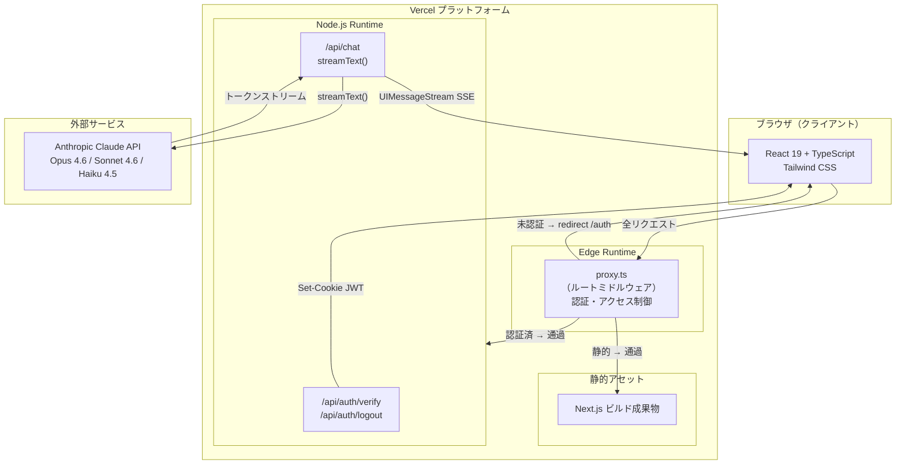

### 2.2 レイヤー構成

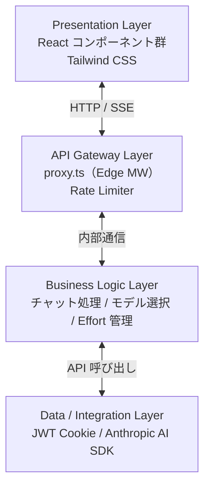

### 2.3 ランタイム分割

| モジュール | ランタイム | 理由 |
|-----------|-----------|------|
| `proxy.ts`（ミドルウェア） | **Edge** | 低レイテンシ認証・全リクエストを横断処理 |
| `/api/auth/verify`, `/api/auth/logout` | **Node.js** | `jose` の Node.js API を使用 |
| `/api/chat` | **Node.js**（`export const runtime = 'nodejs'`） | `jose` Node.js API + インメモリ rate-limiter |

> **ミドルウェアファイルについて**: ファイルは `src/proxy.ts`（`proxy` を named export、`config.matcher` 付き）。Next.js 慣習の `middleware.ts`/`middleware` default export とは異なる命名。Edge ランタイムでは Node.js モジュールが使用できないため、`AUTH_COOKIE_NAME` などの定数を `constants.ts` から import せず、ファイル内にインライン複製している。

---

## 3. 主要コンポーネント設計

### 3.1 フロントエンドコンポーネント階層

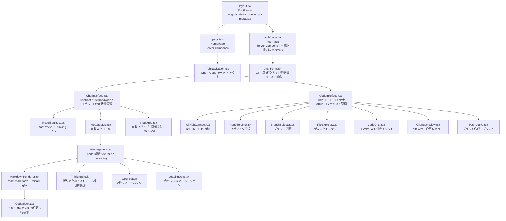

### 3.2 カスタムフック

| フック | ファイル | 責務 |
|-------|--------|------|
| `useDarkMode` | `src/hooks/useDarkMode.ts` | ダークモード状態管理。`MutationObserver` で `<html>` の `dark` クラスを監視、`localStorage 'theme'` で永続化。`isDark` と `toggle` を返す |
| `useImageAttachments` | `src/hooks/useImageAttachments.ts` | 画像添付状態管理。object-URL プレビュー生成・破棄（アンマウント時に revoke）、`image/*` のみ許可 |
| `useGitHub` | `src/hooks/useGitHub.ts` | GitHub API ラッパー。リポジトリ一覧取得、ブランチ取得、ファイルコンテンツ取得、プッシュなど。接続状態・ユーザー情報を管理 |

### 3.3 バックエンドコンポーネント

#### proxy.ts（ルートミドルウェア）

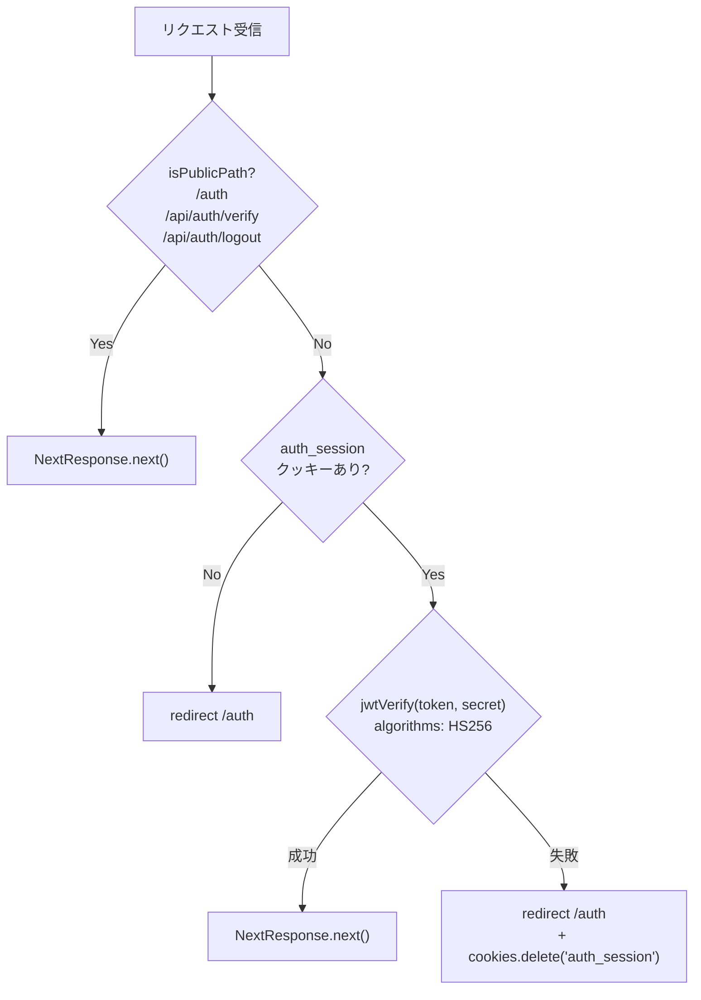

#### API Routes 一覧

| エンドポイント | メソッド | 責務 |
|-------------|--------|------|
| `/api/auth/verify` | POST | レート制限 → コード検証 → JWT 発行 → Set-Cookie |
| `/api/auth/logout` | POST | `auth_session` クッキーを `Max-Age=0` でクリア |
| `/api/chat` | POST | JWT 再検証（多層防御）→ モデル検証 → `streamText()` → UIMessageStream 返却 |
| `/api/code` | POST | Code モード チャット。コンテキスト付きで `streamText()` → UIMessageStream 返却 |
| `/api/github/auth` | GET | GitHub OAuth 認可画面へリダイレクト（`code` パラメータ要求） |
| `/api/github/callback` | GET | GitHub OAuth コールバック。`code` を `token` と交換し、暗号化して `github_token` クッキーに保存 |
| `/api/github/status` | GET | 現在の GitHub 接続状態・ユーザー情報を返却 |
| `/api/github/disconnect` | POST | GitHub トークン削除・接続解除 |
| `/api/github/repos` | GET | 認証済みユーザーのリポジトリ一覧を取得 |
| `/api/github/branches` | GET | 指定リポジトリのブランチ一覧を取得 |
| `/api/github/contents` | GET | 指定リポジトリ・ブランチ・パスのディレクトリツリーまたはファイルコンテンツを取得 |
| `/api/github/push` | POST | 新規ブランチ作成・ファイル変更をコミット・プッシュ |

### 3.4 認証・セキュリティコンポーネント

#### `lib/auth/cookies.ts`（Node.js のみ）

| 関数 | 責務 |
|-----|------|
| `signAuthCookie()` | JWT 生成（payload: `{ authenticated: true }`, alg: HS256, exp: 30d） |
| `verifyAuthCookie(token)` | JWT 検証。成功: `true`、失敗: `false`（例外をキャッチ） |
| `buildCookieHeader(token)` | Set-Cookie ヘッダ文字列生成。本番のみ `Secure` 付与 |
| `buildClearCookieHeader()` | クッキー削除用ヘッダ文字列生成（`Max-Age=0`） |
| `getSecret()`（private） | `COOKIE_SECRET` 環境変数を `Uint8Array` に変換。**32文字未満で例外を throw** |

#### `lib/auth/rate-limiter.ts`

| 項目 | 詳細 |
|-----|------|
| 実装 | モジュールレベル `Map<string, { count: number, windowStart: number }>` |
| キー | IP アドレス（`x-forwarded-for` の第1セグメント、なければ `'127.0.0.1'`） |
| ウィンドウ | 固定ウィンドウ 15分（`RATE_LIMIT_WINDOW_MS = 900000`） |
| 上限 | 10回（`RATE_LIMIT_MAX_ATTEMPTS = 10`） |
| リセット | `now - windowStart > RATE_LIMIT_WINDOW_MS` のときのみリセット（リクエストごとに延長しない） |
| 制約 | Vercel サーバーレスはインスタンスごとに分離（best-effort）。再起動・スケールアウトでリセット |
| 未使用関数 | `cleanupExpiredEntries()` は export 済みだが現在どこからも呼ばれていない |

---

## 4. データフロー設計

### 4.1 認証フロー（ログイン）

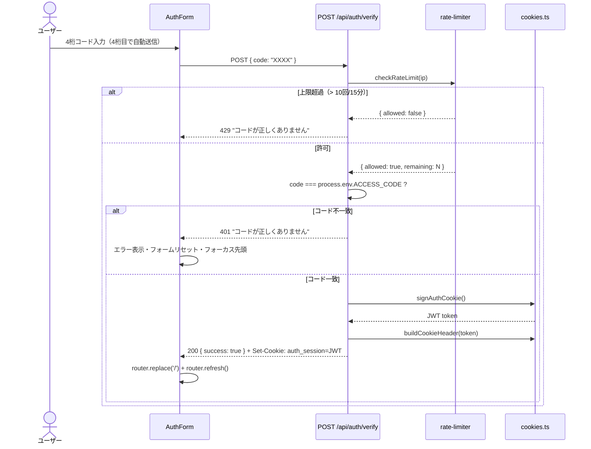

### 4.2 ミドルウェア認証フロー

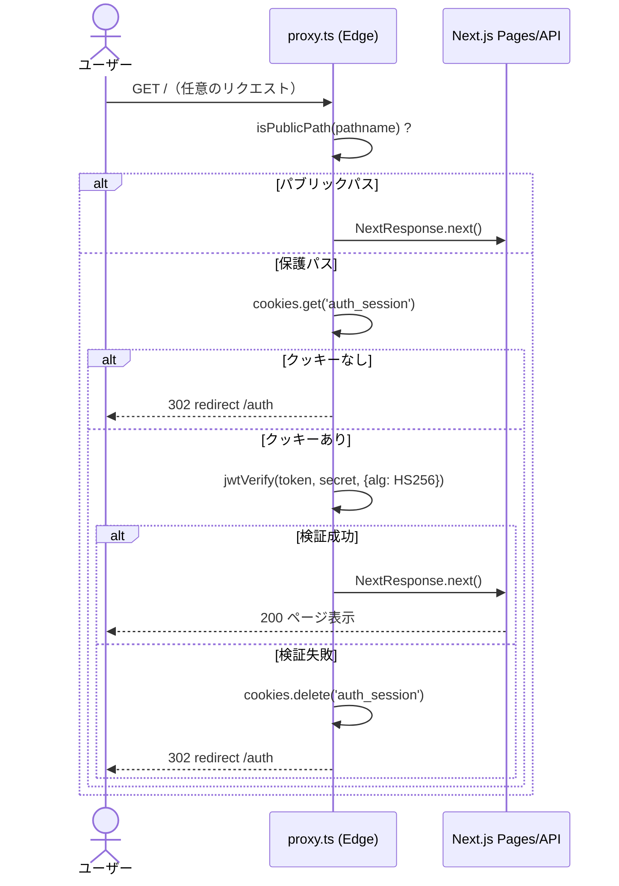

### 4.3 チャットメッセージフロー

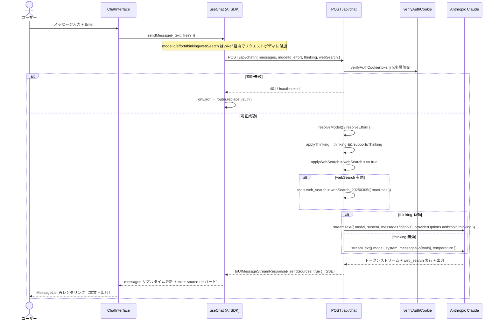

### 4.4 thinking / temperature 排他フロー

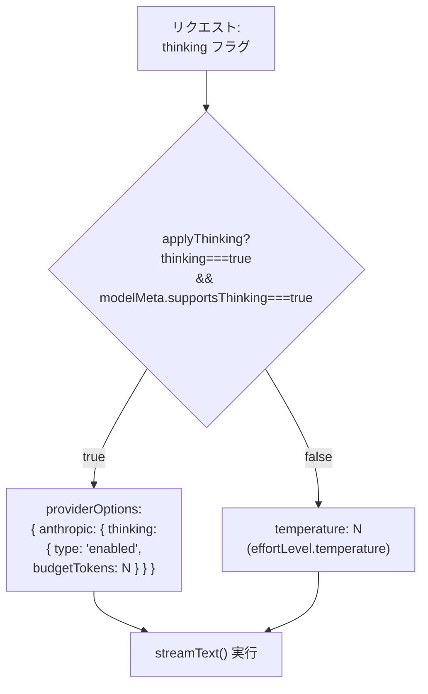

### 4.5 ダークモード状態遷移

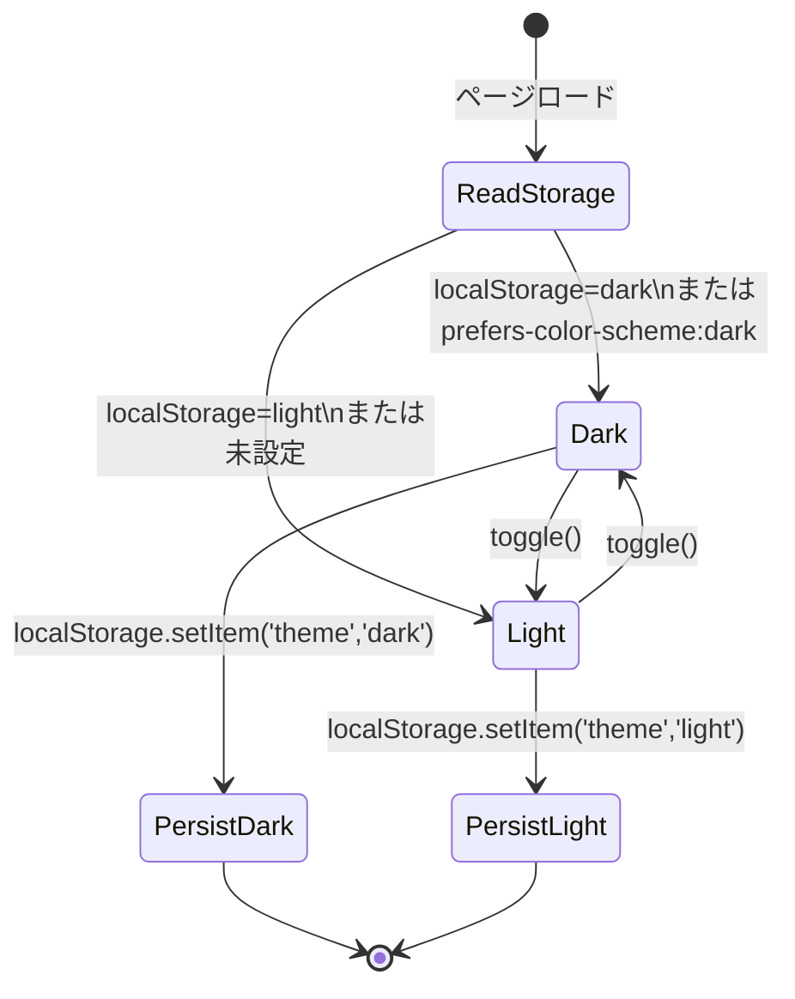

### 4.6 useChat 状態管理（トランスポートパターン）

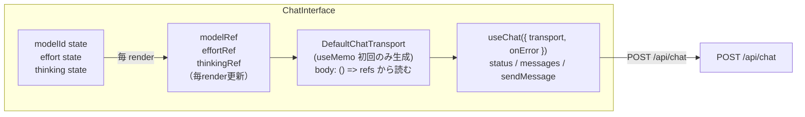

> **ポイント**: `useChat` は transport の変更を無視する仕様のため、transport を `useMemo([])` で一度だけ生成し、毎 render で更新される Ref から最新の modelId/effort/thinking を読み取ることでクロージャの陳腐化を防いでいる。

---

## 5. インターフェース設計

### 5.1 画面遷移図

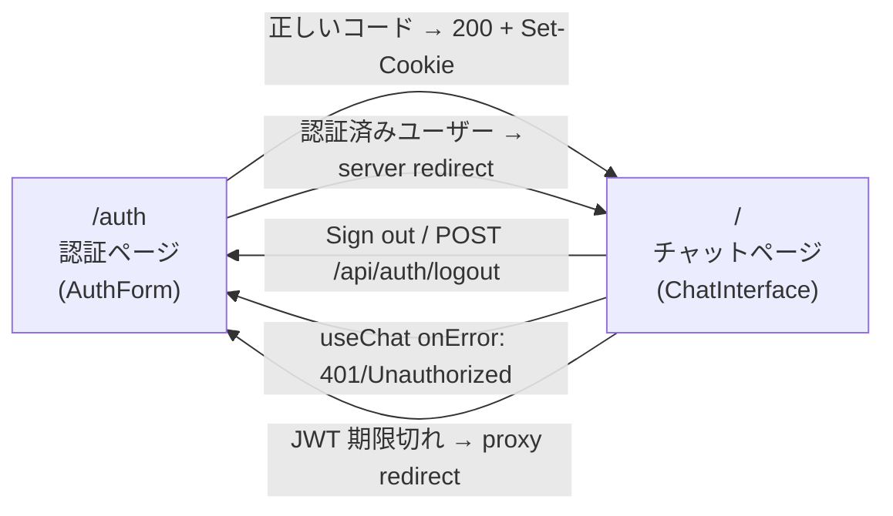

### 5.2 API インターフェース

#### POST /api/auth/verify

```http
リクエスト:
  Content-Type: application/json
  Body: { "code": "1234" }

レスポンス（成功）:
  200 OK
  Set-Cookie: auth_session=<JWT>; Max-Age=2592000; Path=/; HttpOnly; SameSite=Lax[; Secure]
  Body: { "success": true }

レスポンス（全エラー共通）:
  429 / 401 / 400 / 500
  Body: "コードが正しくありません"
```

#### POST /api/auth/logout

```http
リクエスト:
  Cookie: auth_session=<JWT>

レスポンス:
  200 OK
  Set-Cookie: auth_session=; Max-Age=0; Path=/; HttpOnly; SameSite=Lax
  Body: { "success": true }
```

#### POST /api/chat

```http
リクエスト:
  Content-Type: application/json
  Cookie: auth_session=<JWT>
  Body:
    {
      "messages": UIMessage[],  // @ai-sdk/react の UIMessage 型
      "modelId": string,        // 省略時は DEFAULT_MODEL_ID (Haiku)
      "effort": EffortId,       // "low"|"medium"|"high"|"xhigh"|"max"
      "thinking": boolean,      // true かつ supportsThinking=true の場合のみ有効
      "webSearch": boolean      // true の場合のみサーバーサイド Web 検索ツールを付与
    }

レスポンス（成功）:
  200 OK
  Content-Type: text/event-stream
  Body: AI SDK UIMessageStream プロトコル（toUIMessageStreamResponse({ sendSources: true }) 形式）
        webSearch 有効時は source-url パートで出典 URL を含む

レスポンス（エラー）:
  401 Unauthorized  → JWT 検証失敗
  400 Bad Request   → JSON パース失敗 / messages 空配列
```

---

## 6. データ管理設計

### 6.1 データ保存場所

| データ | 保存場所 | 生存期間 |
|--------|---------|---------|
| 会話メッセージ | `useChat` のメモリ（React state） | ページリロードまで |
| 認証セッション | `auth_session` Cookie（JWT） | 30日間 |
| テーマ設定 | `localStorage 'theme'` | 永続 |
| 画像添付プレビュー | `useImageAttachments`（object URL） | 送信 / 削除 / アンマウントまで |

> **永続データベースは使用しない。** 会話履歴はページリロードで消失する。

### 6.2 レート制限データ

| 項目 | 詳細 |
|-----|------|
| 保存場所 | `/api/auth/verify` の Node.js プロセス内モジュールレベル `Map` |
| 制約 | Vercel 複数インスタンス環境では**インスタンスごとに独立**（best-effort） |
| 消失タイミング | サーバー再起動 / コールドスタート / スケールアウト |
| 将来対応 | 将来的に Vercel KV / Redis 等のグローバルストアへの移行を検討 |

### 6.3 将来の永続化スキーマ（参考）

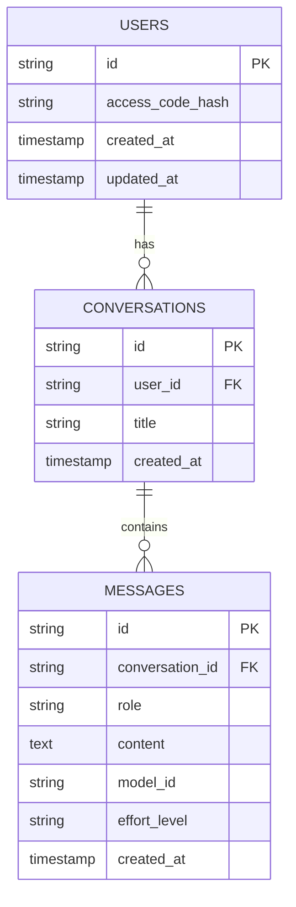

---

## 7. セキュリティ設計

### 7.1 認証・認可

| 項目 | 実装 |
|-----|------|
| 認証方式 | JWT (HS256)。payload: `{ authenticated: true, iat, exp }` |
| 署名秘密 | `COOKIE_SECRET`（32文字以上必須。`cookies.ts` で強制） |
| 有効期限 | 30日（`exp: '30d'`） |
| 二重検証 | `proxy.ts`（Edge）と `/api/chat`（Node）で独立して `verifyAuthCookie` を呼び出す |

### 7.2 Cookie 属性

| 属性 | 値 | 備考 |
|-----|-----|------|
| `HttpOnly` | true | XSS によるトークン窃取防止 |
| `SameSite` | `Lax` | CSRF リスク低減 |
| `Secure` | 本番のみ | `NODE_ENV === 'production'` 時のみ付与 |
| `Max-Age` | 2592000（30日） | セッション有効期限 |
| `Path` | `/` | 全パスで有効 |

> **注意**: クッキークリア用ヘッダ（`buildClearCookieHeader()`）は `Secure` を付与しない。

### 7.3 入力検証

| 入力 | 検証内容 |
|------|---------|
| `code` | 文字列型チェック + `ACCESS_CODE` と `===` 一致確認 |
| `modelId` | `ALLOWED_MODEL_IDS` 許可リスト。不正値は `DEFAULT_MODEL_ID` にフォールバック |
| `effort` | `EFFORT_LEVELS` で検索。不正値は `DEFAULT_EFFORT_ID` にフォールバック |
| `messages` | 非空配列チェック |

### 7.4 レート制限の配置（タイミング攻撃対策）

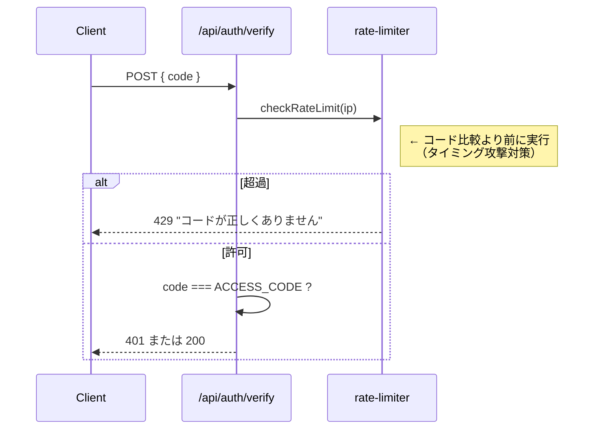

---

## 8. パフォーマンス設計

### 8.1 ダークモードのアンチ FOUC

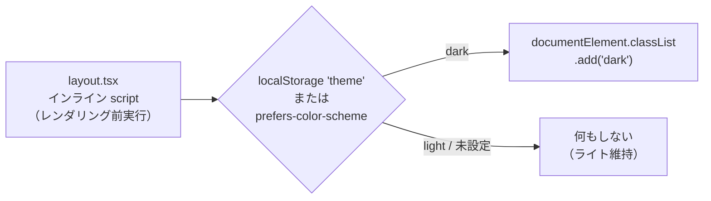

### 8.2 目標パフォーマンス指標

| 指標 | 目標値 |
|------|--------|
| First Contentful Paint (FCP) | < 1.5 秒 |
| Largest Contentful Paint (LCP) | < 2.5 秒 |
| Cumulative Layout Shift (CLS) | < 0.1 |
| Time to Interactive (TTI) | < 3 秒 |
| ストリーミング開始まで | < 500 ms |

---

## 9. エラーハンドリング設計

### 9.1 クライアント側エラー処理

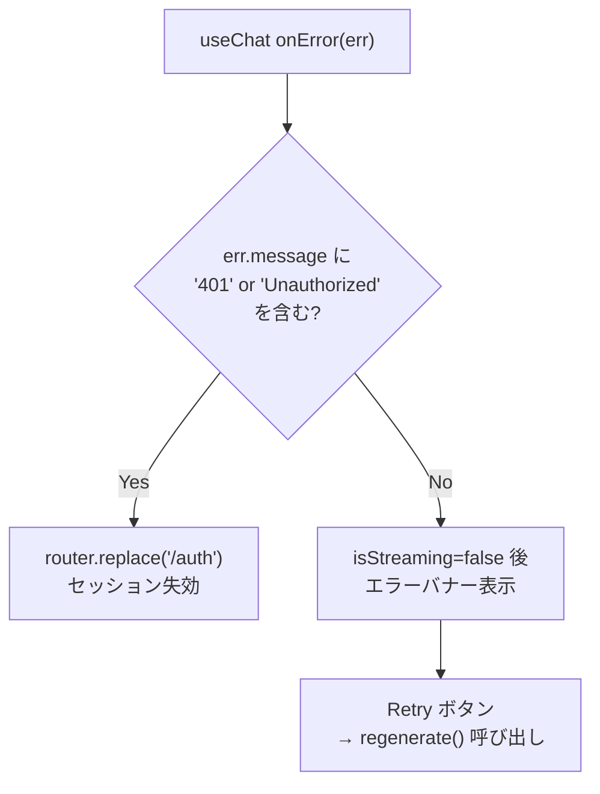

### 9.2 サーバー側エラー応答

| 状況 | ステータス | レスポンス本文 |
|------|----------|-------------|
| JWT 検証失敗（`/api/chat`） | 401 | "Unauthorized" |
| JSON パースエラー | 400 | "Bad Request" |
| messages 空 | 400 | "Bad Request" |
| レート制限超過 | 429 | "コードが正しくありません" |
| コード不一致 | 401 | "コードが正しくありません" |
| `ACCESS_CODE` 未設定 | 500 | "コードが正しくありません" |

---

## 10. GitHub 統合のデータフロー

### 10.1 GitHub OAuth フロー

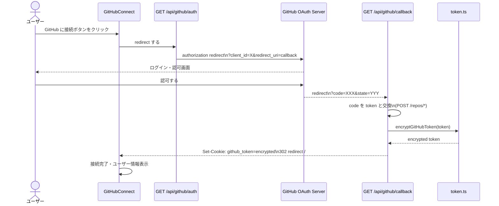

### 10.2 ファイルコンテキスト追加フロー

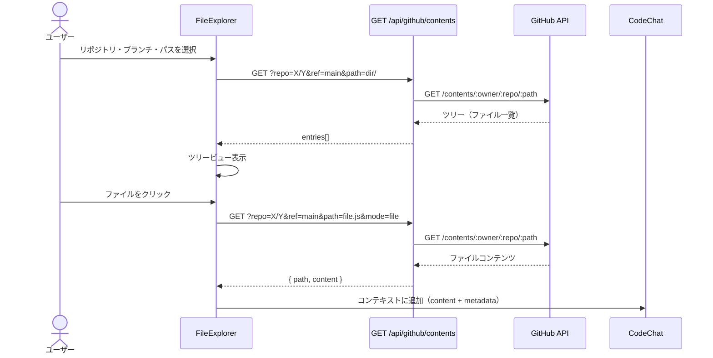

### 10.3 コード修正・プッシュフロー

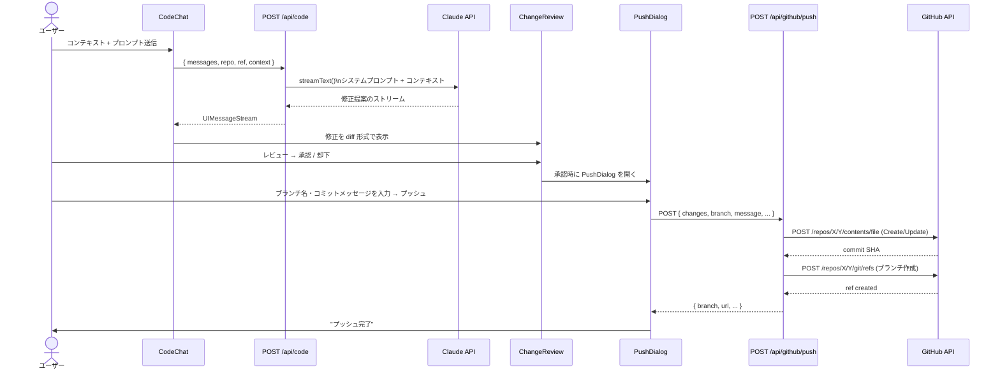

---

## 11. スケーラビリティ設計

| フェーズ | ユーザー数 | インフラ | 注意事項 |
|---------|----------|---------|---------|
| 初期 | 〜100 | Vercel Hobby/Pro | レート制限 per-instance で十分 |
| 成長 | 〜1,000 | Vercel Pro | レート制限を Redis 等へ移行検討 |
| エンタープライズ | 〜10,000+ | Vercel Enterprise / 専用 | DB 永続化・マルチユーザー認証対応 |

---

## 12. 拡張性設計

### 12.1 将来拡張ポイント

1. **レート制限のグローバル化**: `rate-limiter.ts` のインメモリ `Map` を Vercel KV / Redis に置き換え
2. **会話履歴の永続化**: `useChat` の messages を DB に保存するカスタムハンドラ追加
3. **ユーザー管理**: `ACCESS_CODE` 方式から OAuth / パスワードハッシュ方式へ移行
4. **新モデル追加**: `constants.ts` の `MODELS` 配列にエントリを追加するだけで対応可能
5. **ファイル添付拡張**: `useImageAttachments` を汎用添付に拡張
6. **複数リポジトリサポート**: 同時に複数リポジトリを操作可能に拡張

---

## 13. 変更履歴

| 版 | 日付 | 変更内容 |
|----|------|--------|
| 1.0 | 2026-06-18 | 初版作成 |
| 1.1 | 2026-06-20 | GitHub 統合機能を追加 |
