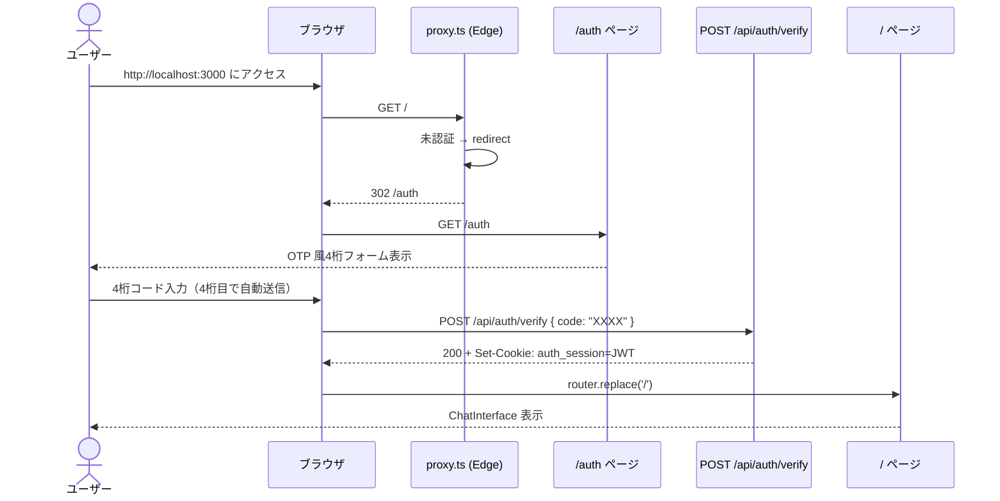
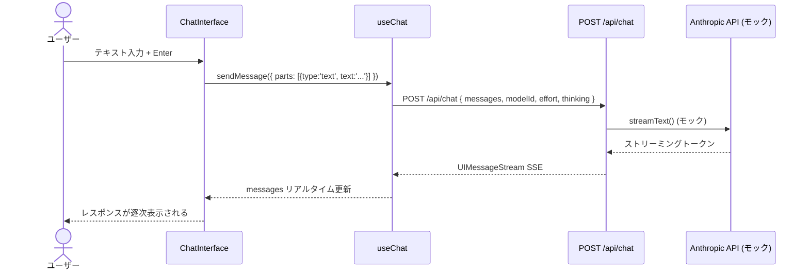

# 05_結合テスト仕様書

## 1. 結合テスト仕様書の概要

**作成日**: 2026-06-18  
**対象版**: 1.0  
**対象要件定義書**: 01_要件定義書.md  

本ドキュメントは、複数のコンポーネント・モジュール間の連携動作をテストするための仕様を定義します。

---

## 2. テスト方針

### 2.1 前提条件・注意事項

> **重要**: 現在の `package.json` には `test:integration` / `test:e2e` スクリプトが定義されていません。  
> 以下のテストを実行するには、別途 E2E テスト環境の構築が必要です。

### 2.2 推奨テストツール

- **フレームワーク**: Playwright（推奨）または Cypress
- **対象ブラウザ**: Chrome, Firefox
- **モック**: Playwright の `page.route()` で Anthropic API をモック

### 2.3 テスト実行コマンド（導入後）

```bash
npx playwright test                  # 全結合テスト
npx playwright test --project=chrome # Chrome のみ
npx playwright test --headed         # ブラウザ表示モード
npx playwright show-report           # レポート確認
```

---

## 3. 認証フロー全体図



---

## 4. 認証フローの結合テスト

### 4.1 IT-AUTH-001: ログインフロー全体

**テスト名**: OTP 風4桁コード入力からチャット画面表示まで

**前提条件**:
- アプリが起動している
- `ACCESS_CODE` が環境変数に設定されている

```gherkin
機能: ログインフロー

シナリオ: 正しいアクセスコードでログイン
  Given: ブラウザで http://localhost:3000 にアクセスする
  Then: /auth ページにリダイレクトされる
  And: OTP 風4桁入力フォームが表示される
  And: 最初の入力フィールドにフォーカスが当たっている

  When: 正しい4桁コードを1桁ずつ入力する
  Then: 入力のたびに次のフィールドにフォーカスが移る
  And: 4桁目入力で自動的に POST /api/auth/verify が送信される

  Then: / へリダイレクトされる
  And: auth_session クッキーが設定されている
  And: ChatInterface が表示される
  And: モデル選択セレクトボックスが表示される
  And: メッセージ入力テキストエリアが表示される
```

**期待結果**:
- ✅ /auth → / への遷移成功
- ✅ auth_session クッキー設定
- ✅ ChatInterface 表示

---

### 4.2 IT-AUTH-002: 誤ったコードでのログイン失敗

```gherkin
シナリオ: 誤ったアクセスコードでログイン失敗
  Given: /auth ページが表示されている
  When: 誤った4桁コードを入力する
  Then: エラーメッセージ「コードが正しくありません」が表示される
  And: フォームがリセットされ最初の入力にフォーカスが戻る
  And: /auth ページに留まる
  And: auth_session クッキーが設定されていない
```

---

### 4.3 IT-AUTH-003: 認証済みユーザーの /auth アクセス

```gherkin
シナリオ: 認証済みユーザーが /auth にアクセス
  Given: ユーザーが正常にログイン済みである
  When: ブラウザで /auth に直接アクセスする
  Then: サーバー側で / へリダイレクトされる
  And: ChatInterface が表示される
```

---

### 4.4 IT-AUTH-004: JWT 有効期限切れ

```gherkin
シナリオ: JWT 期限切れ後のアクセス
  Given: ユーザーがログイン済みである
  When: auth_session クッキーを改ざんまたは期限切れにする
  And: / にアクセスする
  Then: proxy.ts が JWT 検証失敗を検出する
  And: 改ざんされたクッキーが削除される
  And: /auth へリダイレクトされる
```

---

### 4.5 IT-AUTH-005: ログアウト

```gherkin
シナリオ: Sign out ボタンでログアウト
  Given: ユーザーが / でチャット画面を表示している
  When: "Sign out" ボタンをクリックする
  Then: POST /api/auth/logout が送信される
  And: auth_session クッキーが削除される
  And: /auth ページに遷移する
```

---

## 5. チャット機能の結合テスト

### 5.1 チャットフロー全体図



### 5.2 IT-CHAT-001: メッセージ送受信フロー

**前提条件**:
- ユーザーがログイン済み
- Anthropic API をモック（固定レスポンス返却）

```gherkin
機能: チャット送受信

シナリオ: テキストメッセージを送信してレスポンスを受信
  Given: チャット画面が表示されている
  And: Anthropic API がモックされている

  When: "こんにちは" と入力して Enter を押す
  Then: 入力フィールドがクリアされる
  And: MessageList にユーザーメッセージ "こんにちは" が追加される
  And: ローディングアニメーション（LoadingDots）が表示される
  And: POST /api/chat が送信される

  Then: ストリーミングレスポンスが受信される
  And: ローディングが消えレスポンスが表示される
  And: レスポンスがマークダウン形式でレンダリングされる
  And: ストリーミング中はブリンクカーソルが表示される
  And: 完了後にコピーボタンが表示される
```

---

### 5.3 IT-CHAT-002: モデル切り替えの反映

```gherkin
シナリオ: Opus モデルに切り替えてメッセージ送信
  Given: チャット画面が表示されている（既定: Haiku）
  When: ヘッダのモデル選択で "Opus 4.6" を選択する
  Then: アプリ名が "claude-opus-app" に更新される
  And: ⚙ ギアボタンで ModelSettings を開くと Extended Thinking トグルが有効になる

  When: メッセージを送信する
  Then: POST /api/chat のリクエストボディに "modelId": "claude-opus-4-6" が含まれる
```

---

### 5.4 IT-CHAT-003: Extended Thinking の有効化

```gherkin
シナリオ: Opus + Thinking 有効でメッセージ送信
  Given: モデルとして Opus 4.6 が選択されている
  When: ModelSettings を開いて Extended Thinking トグルを ON にする
  And: メッセージを送信する
  Then: POST /api/chat のリクエストに "thinking": true が含まれる
  And: レスポンスに ThinkingBlock が表示される（ストリーミング中は展開）
  And: 完了後に ThinkingBlock を手動で折りたたみ・展開できる
```

---

### 5.5 IT-CHAT-004: Haiku 選択時の Effort ゲーティング

```gherkin
シナリオ: Haiku 選択時の UI 制約確認
  Given: モデルとして Haiku 4.5 が選択されている
  When: ⚙ ギアボタンで ModelSettings を開く
  Then: "低" 以外の Effort ラジオボタンが disabled になっている
  And: Extended Thinking トグルが disabled になっている
  And: "低" ラジオボタンのみ有効である
```

---

### 5.6 IT-CHAT-005: 会話コンテキストの維持

```gherkin
シナリオ: 複数往復の会話
  Given: チャット画面が表示されている

  When: "日本の首都は？" と送信する
  Then: レスポンスを受信する

  When: 続けて "その面積は？" と送信する
  Then: POST /api/chat のリクエストに過去のメッセージが含まれる
    And: messages[0] = { role: "user", content: "日本の首都は？" }
    And: messages[1] = { role: "assistant", content: "..." }
    And: messages[2] = { role: "user", content: "その面積は？" }
```

---

### 5.7 IT-CHAT-006: 画像添付送信

```gherkin
シナリオ: 画像を添付してメッセージを送信
  Given: チャット画面が表示されている
  When: 入力エリアに PNG 画像をペーストする
  Then: サムネイルプレビューが表示される
  And: 削除ボタンが表示される

  When: テキストを入力して送信する
  Then: POST /api/chat のリクエストに FileUIPart が含まれる
  And: サムネイルプレビューが消える
  And: MessageList のユーザーメッセージに画像サムネイルが表示される
```

---

### 5.8 IT-CHAT-007: コードブロックの表示と操作

```gherkin
シナリオ: コードを含むレスポンスの表示
  Given: アシスタントが Python コードを返す（モック）
    """
    ```python
    def hello():
        print("world")
    ```
    """
  Then: CodeBlock コンポーネントが表示される
  And: Python として構文強調表示される
  And: コピーボタンが表示される

  When: コピーボタンをクリックする
  Then: クリップボードにコードがコピーされる
  And: ボタンラベルが一時的に変化する（コピー済みフィードバック）
```

---

## 6. レート制限の結合テスト

### 6.1 IT-RATE-001: ログイン試行レート制限

```gherkin
機能: ログイン試行レート制限

シナリオ: 10回誤ったコードで試行後に制限
  Given: /auth ページが表示されている
  When: 誤ったコードで10回ログイン試行する
  Then: 各リクエストに対してエラーメッセージが表示される

  When: 11回目のログイン試行をする
  Then: 429 が返却される
  And: 「コードが正しくありません」が表示される
  And: ※ エラー内容（レート制限か否か）はユーザーに区別されない
```

---

## 7. エラーハンドリングの結合テスト

### 7.1 IT-ERROR-001: Anthropic API エラー

```gherkin
機能: API エラーハンドリング

シナリオ: Anthropic API がエラーを返す（モック）
  Given: チャット画面が表示されている
  And: Anthropic API が 500 を返すようにモックされている

  When: メッセージを送信する
  Then: エラーバナー "Request failed" が表示される
  And: Retry ボタンが表示される

  When: Retry ボタンをクリックする
  Then: regenerate() が呼ばれ再試行される
```

---

### 7.2 IT-ERROR-002: チャット中のセッション失効

```gherkin
シナリオ: チャット中に JWT が無効になる
  Given: チャット画面が表示されている
  And: /api/chat が 401 を返すようにモックされている

  When: メッセージを送信する
  Then: useChat の onError が 401 を検出する
  And: router.replace('/auth') が呼ばれる
  And: /auth ページに遷移する
```

---

## 8. ダークモードの結合テスト

### 8.1 IT-DARK-001: テーマ切替と永続化

```gherkin
機能: ダークモード

シナリオ: ダークモードに切り替えて再訪問
  Given: チャット画面がライトモードで表示されている
  When: ヘッダの月アイコンをクリックする
  Then: ページがダークモードになる
  And: localStorage 'theme' が 'dark' に設定される

  When: ページをリロードする
  Then: ページがダークモードで表示される（FOUC なし）
  And: CodeBlock がダーク用スタイル（vscDarkPlus）を使用している
```

---

## 9. パフォーマンスの結合テスト

### 9.1 IT-PERF-001: ページロード時間

```gherkin
機能: パフォーマンス

シナリオ: ページロード時間の計測
  Given: Lighthouse またはブラウザの Performance API を使用
  When: http://localhost:3000 にアクセスして / まで遷移する
  Then: First Contentful Paint (FCP) < 1.5s
  And: Largest Contentful Paint (LCP) < 2.5s
  And: Cumulative Layout Shift (CLS) < 0.1
  And: Time to Interactive (TTI) < 3s
```

---

### 9.2 IT-PERF-002: ストリーミング応答速度

```gherkin
シナリオ: ストリーミング開始の応答速度
  Given: チャット画面が表示されている
  When: メッセージを送信する
  Then: ストリーミング最初のトークンが 500ms 以内に表示される
```

---

## 10. セキュリティの結合テスト

### 10.1 IT-SEC-001: 未認証アクセスのブロック

```gherkin
機能: 認証ガード

シナリオ: クッキーなしで / にアクセス
  Given: auth_session クッキーが存在しない
  When: / に直接アクセスする
  Then: proxy.ts がリクエストをブロックする
  And: /auth にリダイレクトされる
```

---

### 10.2 IT-SEC-002: 改ざんクッキーの検出

```gherkin
シナリオ: 改ざんされたクッキーでのアクセス
  Given: auth_session クッキーが手動で改ざんされている
  When: / にアクセスする
  Then: proxy.ts が JWT 検証失敗を検出する
  And: 改ざんクッキーが削除される
  And: /auth にリダイレクトされる
```

---

### 10.3 IT-SEC-003: Cookie の HttpOnly 確認

```gherkin
シナリオ: Cookie の HttpOnly 属性確認
  Given: ユーザーがログイン済みである
  When: ブラウザコンソールで document.cookie を確認する
  Then: auth_session が含まれない（HttpOnly のため JavaScript からアクセス不可）
```

---

## 11. 並行セッションの結合テスト

### 11.1 IT-CONCURRENT-001: 複数ブラウザウィンドウ

```gherkin
機能: 並行セッション

シナリオ: 複数ウィンドウから同時チャット
  Given: 2つのブラウザウィンドウ（または Playwright の2コンテキスト）でログイン済み
  When: ウィンドウ1とウィンドウ2で同時にメッセージを送信する
  Then: 各ウィンドウが独立してレスポンスを受信する
  And: 会話履歴はウィンドウ間で混在しない
```

---

## 12. テスト実行計画

| 環境 | 用途 | タイミング |
|------|------|----------|
| ローカル開発環境 | 開発中の確認 | 随時 |
| ステージング（Vercel Preview） | PR レビュー前 | PR 作成時 |
| 本番環境 | リリース前最終確認 | リリース当日 |

---

## 13. 変更履歴

| 版 | 日付 | 変更内容 |
|----|------|--------|
| 1.0 | 2026-06-18 | 初版作成 |
