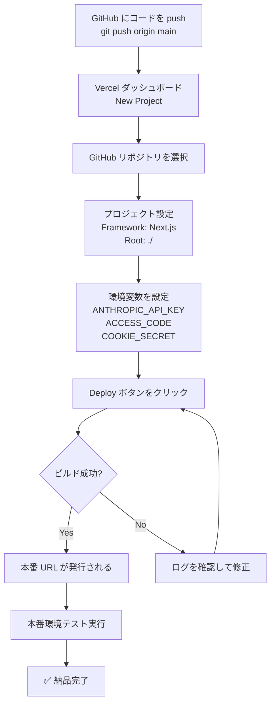
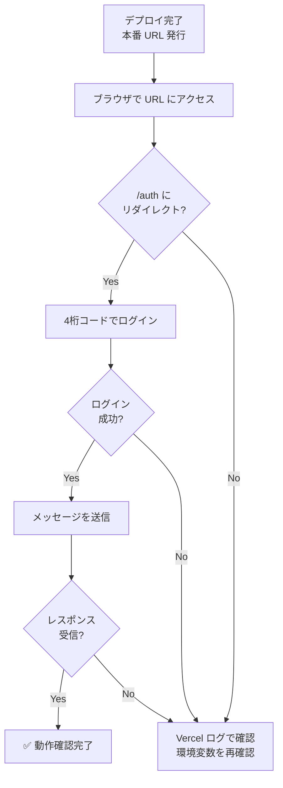
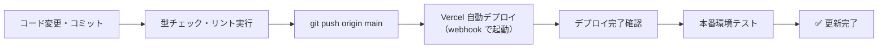
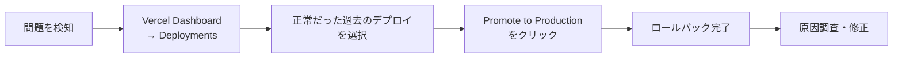

# 07_納品手順書

## 1. 納品手順書の概要

**作成日**: 2026-06-18  
**対象版**: 1.0  
**対象環境**: Vercel  

本ドキュメントは、本番環境へのアプリケーション納品のための手順を定義します。

---

## 2. 納品前チェックリスト

### 2.1 コード品質チェック

> **注意**: `package.json` に定義済みのスクリプトのみ実行可能です。
> `test` / `test:integration` / `test:e2e` は未整備のため別途テスト環境の構築が必要です。

- [ ] **TypeScript 型チェック**（スクリプト定義済み）
  ```bash
  npm run type-check   # tsc --noEmit
  ```
  期待: ✅ エラー 0 件

- [ ] **ESLint チェック**（スクリプト定義済み）
  ```bash
  npm run lint         # eslint src --ext .ts,.tsx
  ```
  期待: ✅ エラー 0 件

- [ ] **ビルド成功確認**（スクリプト定義済み）
  ```bash
  npm run build        # next build
  ```
  期待: ✅ ビルドエラー 0 件

- [ ] **ユニットテスト**（要別途環境構築）
  ```bash
  npm test             # 未定義 → jest 導入後に実行
  ```

- [ ] **結合テスト / E2E テスト**（要別途環境構築）
  ```bash
  npx playwright test  # playwright 導入後に実行
  ```

### 2.2 セキュリティチェック

- [ ] **環境変数が .env.local で管理**（コードにハードコードなし）
  - [ ] `ANTHROPIC_API_KEY` が `.env.local` で定義
  - [ ] `ACCESS_CODE` が `.env.local` で定義（4桁数字）
  - [ ] `COOKIE_SECRET` が `.env.local` で定義（32文字以上）
  - [ ] `.env.local` が `.gitignore` に含まれる

- [ ] **COOKIE_SECRET の強度確認**
  ```bash
  # 推奨生成方法:
  openssl rand -base64 32
  # 出力は32文字以上であること
  ```

- [ ] **依存関係のセキュリティスキャン**
  ```bash
  npm audit
  ```
  期待: ✅ 重大な脆弱性 0 件

- [ ] **HTTPS 通信確認**（Vercel で自動）

### 2.3 ドキュメントチェック

- [ ] 01_要件定義書.md ✅
- [ ] 02_基本設計書.md ✅
- [ ] 03_詳細設計書.md ✅
- [ ] 04_単体テスト仕様書.md ✅
- [ ] 05_結合テスト仕様書.md ✅
- [ ] 06_総合テスト仕様書.md ✅
- [ ] 07_納品手順書.md ✅

### 2.4 本番環境対応チェック

- [ ] 本番 URL が決定（例: `https://your-app.vercel.app`）
- [ ] Vercel プロジェクトが作成済み
- [ ] 環境変数が Vercel Dashboard に設定済み
  - [ ] `ANTHROPIC_API_KEY`
  - [ ] `ACCESS_CODE`
  - [ ] `COOKIE_SECRET`
- [ ] GitHub リポジトリが最新状態に更新済み

---

## 3. 納品準備手順

### 3.1 ステップ 1: 最終ビルド実行

```bash
# クリーンビルド
Remove-Item -Recurse -Force node_modules  # または rm -rf node_modules
Remove-Item -Recurse -Force .next          # または rm -rf .next

# 依存関係インストール
npm install

# 型チェック
npm run type-check

# リントチェック
npm run lint

# ビルド
npm run build
```

**確認項目**:
- [ ] `type-check` エラー 0 件
- [ ] `lint` エラー 0 件
- [ ] ビルドエラー 0 件
- [ ] `.next/` ディレクトリが生成されている

---

### 3.2 ステップ 2: ローカル本番テスト

```bash
npm start   # Next.js 本番モード起動

# ブラウザで http://localhost:3000 を開く
```

**確認項目**:
- [ ] `http://localhost:3000` にアクセスすると `/auth` にリダイレクト
- [ ] 4桁コードを入力してログインできる（OTP 風フォーム）
- [ ] ログイン後にチャット画面が表示される
- [ ] メッセージを送信してストリーミングレスポンスを受信できる
- [ ] ログアウトで `/auth` に戻る

---

### 3.3 ステップ 3: Git の状態確認

```bash
git status
git log --oneline -5  # 最近のコミット確認
```

**確認項目**:
- [ ] `.env.local` が追跡されていない（`.gitignore` で除外）
- [ ] `node_modules/` が追跡されていない
- [ ] `.next/` が追跡されていない
- [ ] 想定外のファイルが追跡されていない

---

### 3.4 ステップ 4: デプロイ用ファイル確認

```bash
ls src/
# 期待: app/ components/ hooks/ lib/ proxy.ts

ls -la
# 期待: package.json / package-lock.json / next.config.ts
#       tsconfig.json / .gitignore / .env.local.example
```

---

## 4. Vercel デプロイ手順

### 4.1 デプロイフロー



### 4.2 Vercel プロジェクト作成（Web UI）

1. https://vercel.com にアクセスしてログイン
2. **[Add New Project]** をクリック
3. GitHub リポジトリを選択
4. プロジェクト設定:
   ```
   Project Name: vercel-claude-app（任意）
   Framework Preset: Next.js
   Root Directory: ./
   ```
5. **Environment Variables** に以下を設定:

   | 変数名 | 値 | 説明 |
   |--------|-----|------|
   | `ANTHROPIC_API_KEY` | `sk-ant-...` | Anthropic の API キー |
   | `ACCESS_CODE` | `1234`（例） | 4桁のアクセスコード |
   | `COOKIE_SECRET` | `openssl rand -base64 32` の出力 | 32文字以上の秘密鍵 |

6. **[Deploy]** をクリック

---

### 4.3 Vercel CLI 経由でのデプロイ（代替手順）

```bash
# Vercel CLI インストール（未インストールの場合）
npm i -g vercel

# Vercel にログイン
vercel login

# プロジェクト初期化
vercel

# 本番デプロイ
vercel --prod
```

---

### 4.4 デプロイ後確認手順



**確認コマンド**:
```bash
# ログ確認
vercel logs <deployment-url>

# デプロイ一覧
vercel list
```

---

## 5. カスタムドメイン設定

### 5.1 Vercel ダッシュボードでの設定

1. Vercel Dashboard → プロジェクト → **Settings** → **Domains**
2. **[Add Domain]** でドメイン入力（例: `claude-app.example.com`）
3. 表示される DNS レコードをドメインプロバイダに設定:

```
Type: CNAME
Name: claude-app
Value: cname.vercel-dns.com
```

### 5.2 DNS 反映確認

```bash
# DNS 反映確認（数分〜数時間かかる場合あり）
nslookup claude-app.example.com
```

---

## 6. 監視・ログ設定

### 6.1 Vercel ダッシュボードで確認

- **Deployments**: デプロイ履歴・ビルドログ
- **Functions**: サーバーレス関数のログ・エラー
- **Analytics**（Vercel Pro）: パフォーマンス指標

```bash
# リアルタイムログ（CLI）
vercel logs --follow
```

### 6.2 Anthropic コンソール

- URL: https://console.anthropic.com
- 確認項目: API キーの有効期限 / 使用量 / レート制限状況

---

## 7. バージョン管理と更新

### 7.1 バージョンタグ作成

```bash
# バージョンタグ作成
git tag -a v1.0.0 -m "Release v1.0.0"

# タグを push
git push origin v1.0.0

# タグ一覧確認
git tag -l
```

### 7.2 本番環境の更新手順



```bash
# 1. コード変更
git add <files>
git commit -m "feat: 機能追加の説明"

# 2. 品質チェック
npm run type-check
npm run lint

# 3. push（Vercel 自動デプロイが起動）
git push origin main

# 4. デプロイ確認
vercel list
```

---

## 8. トラブルシューティング

### 8.1 デプロイ失敗時

**症状: ビルドエラー**
```bash
# ローカルで再現して原因特定
npm run build

# よくある原因:
# - TypeScript エラー → npm run type-check で確認
# - 環境変数未設定 → Vercel Dashboard で確認
# - Node.js バージョン不一致 → next.config.ts で engines 指定
```

**症状: 環境変数が読めない**
- Vercel Dashboard → Settings → Environment Variables を確認
- `COOKIE_SECRET` が32文字以上であることを確認
- 変数は再デプロイ後に反映される

---

### 8.2 ログイン失敗

| 症状 | 確認箇所 | 対処 |
|------|---------|------|
| 正しいコードでも 401 | `ACCESS_CODE` 環境変数 | 値を再確認・スペースなどを除去 |
| ページが /auth から遷移しない | Vercel ログ | Function ログでエラーを確認 |
| JWT 検証失敗が続く | `COOKIE_SECRET` | 32文字以上であることを確認 |

---

### 8.3 チャット送信エラー

| 症状 | 確認箇所 | 対処 |
|------|---------|------|
| 「Request failed」バナー | Vercel Function ログ | `/api/chat` のエラーを確認 |
| 常に 401 | JWT クッキー | 再ログインを試みる |
| ストリーミングが止まる | Anthropic ステータス | https://status.anthropic.com を確認 |
| `COOKIE_SECRET` エラー | サーバーログ | `getSecret()` の例外ログ確認 |

---

## 9. ロールバック手順

### 9.1 ロールバック判断基準

| 重大度 | 症状 | 判断 |
|-------|------|------|
| 致命的 | ログインが全ユーザーに不可 | 即時ロールバック |
| 高 | チャット機能が一部ユーザーで不可 | 調査後 1時間以内に判断 |
| 中 | UI 表示崩れ | 原因特定後にパッチリリース |
| 低 | 軽微なスタイルの乱れ | 次のリリースで対応 |

### 9.2 Vercel でのロールバック



**Vercel Web UI 手順**:
1. Dashboard → プロジェクト → **Deployments**
2. ロールバック先のデプロイを選択（正常だった最後のデプロイ）
3. **[Promote to Production]** をクリック

**Vercel CLI 手順**:
```bash
# デプロイ履歴確認
vercel list

# 特定デプロイに切り替え
vercel promote <DEPLOYMENT_ID>
```

### 9.3 Git でのロールバック

```bash
# コミット履歴確認
git log --oneline -10

# 新規リバートコミット（履歴を保持する安全な方法）
git revert <COMMIT_HASH>
git push origin main
# → Vercel が自動デプロイ
```

---

## 10. 納品チェックリスト（最終確認）

### 10.1 機能確認

- [ ] **ログイン**: 4桁コード入力 → / 表示 ✅
- [ ] **チャット**: メッセージ送信 → ストリーミングレスポンス ✅
- [ ] **モデル選択**: Opus / Sonnet / Haiku で動作 ✅
- [ ] **Effort レベル**: 5段階設定可能 ✅
- [ ] **Extended Thinking**: Opus/Sonnet で有効化 ✅
- [ ] **画像添付**: PNG/JPEG の添付と送信 ✅
- [ ] **ダークモード**: 切替と永続化 ✅
- [ ] **マークダウン**: Headers / Lists / Code ブロック表示 ✅
- [ ] **ログアウト**: クッキー削除 → /auth 遷移 ✅

### 10.2 パフォーマンス

- [ ] FCP < 1.5s: -
- [ ] LCP < 2.5s: -
- [ ] CLS < 0.1: -

### 10.3 セキュリティ

- [ ] HTTPS: ✅（Vercel 自動）
- [ ] Cookie: HttpOnly / SameSite=Lax: ✅
- [ ] JWT 検証: 多層防御: ✅
- [ ] 環境変数: コード外で管理: ✅
- [ ] ACCESS_CODE: `.env.local` のみ: ✅

### 10.4 ドキュメント

- [ ] 設計書7点: 完成 ✅

### 10.5 デプロイメント

- [ ] Vercel デプロイ: 完了
- [ ] 本番 URL: -
- [ ] バージョンタグ: v1.0.0

---

## 11. 納品後の対応

### 11.1 定期メンテナンス

**月次**:
- [ ] セキュリティアップデート確認
  ```bash
  npm audit
  npm outdated
  ```
- [ ] Vercel ログでエラー頻度を確認

**四半期**:
- [ ] パフォーマンス計測（Lighthouse）
- [ ] 依存パッケージの更新検討

### 11.2 バージョンアップ計画

| バージョン | 予定 | 予定項目 |
|----------|------|---------|
| v1.0.0 | - | 初回リリース |
| v1.1.0 | - | レート制限の Redis 移行 |
| v1.2.0 | - | 会話履歴の永続化 |
| v2.0.0 | - | マルチユーザー認証 |

---

## 12. 連絡先

### 12.1 関係者連絡先

| 役職 | 名前 | メール | 電話 |
|------|------|--------|------|
| プロジェクトマネージャー | - | - | - |
| 開発リード | - | - | - |
| QA マネージャー | - | - | - |
| インフラ担当 | - | - | - |

### 12.2 外部サービス連絡先

| サービス | URL | サポート |
|---------|------|---------|
| Vercel | https://vercel.com | https://vercel.com/support |
| Anthropic | https://anthropic.com | https://support.anthropic.com |

---

## 13. 変更履歴

| 版 | 日付 | 変更内容 |
|----|------|--------|
| 1.0 | 2026-06-18 | 初版作成 |

---

## 14. 最終確認サイン

**納品実施者**:  
名前: ___________________________  
日付: ___________________________  
サイン: ___________________________  

**納品受け取り者**:  
名前: ___________________________  
日付: ___________________________  
サイン: ___________________________  

**備考**:  
___________________________________________________________________  
___________________________________________________________________  
___________________________________________________________________  
